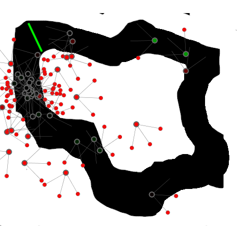
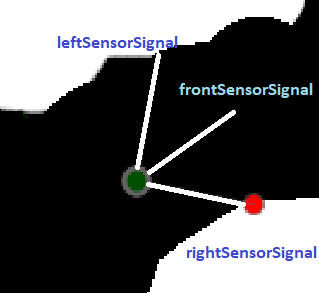
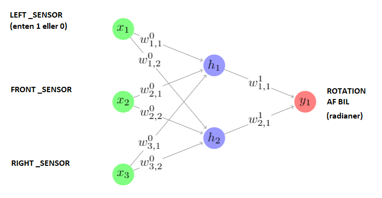
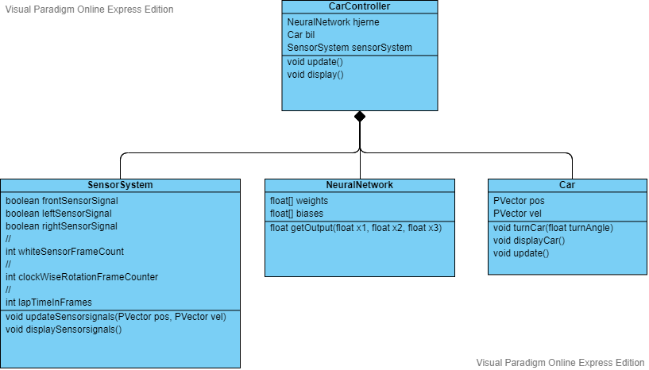

# Racerbils Neuro Evolution
Dette repo indeholder kode og materiale til forløbet "Racerbils Evolution".  
Formålet med forløbet er at bygge en Genetisk Algoritme, der kun udvikle den hurtigst mulige racerbil.   
Dvs. den bil der kan gennemføre en omgang på den virtuelle 2D-racerbane, hurtigst muligt uden at køre galt. 
Racerbilerne styres af et såkaldt neuralt netværk.

## Bekrivelse af programmet 
### Racerbils Evolutions Programmet
Mappen "RacerBilsEvolutionsProgram" indeholder et program til at generere "tilfældige" simple autonome racerbiler i en 2D verden. 
Med tilfældige menes at deres hjerner, et simpelt neuralt netværk, endnu ikke er indstillet/optimeret. 
De autonome bilers sensorsystem kan genkende to forskellige farver: "hvid" som er udenfor banen og "grøn" som er målstregen.
Genkendelse af farven grøn kan bruges til at beregne hvor hurtigt bilen gennemfører en omgang.
Bilerne bevæger sig med en konstant hastighed på 5 pixels pr. frame,- og ændre retning ved at rotere om egen akse. Nedenfor ses en sreenshot af programmet: 

### Racerbilen grafiske visning
Nedenfor ses en racerbil som den ser ud i programmet. Den højre sensor har detekteret den hvide farve og lyser rødt:

## Beksrivelse af bilens hjerne : Det Neurale Netværk
Bilernes hjerner styrer bilen ved at reagere på input fra de sensorer, der registerer farven "hvid", da alt udenfor banen er hvidt.
Hjernen fortæller baseret på sine input om bilen skal rotere til venstre eller højre.
Hjernen er et simpelt fuldt forbundet feedforward Neuralt Netværk. Nedenfor ses et diagram over bilen neurale netværk: 

Et neuralt netværk er opbygget af neuroner (vist med cirkler), som modtager et vilkårligt antal input som hver bliver multipliceret med et tal kaldet en "vægt" (vist som w), reultatet bliver adderet med et andet tal kaldet "bias" (ikke vist) og sendes igennem en matematisk funktion kaldet en "aktiverings funktion"(ikke vist). Vi arbejder med meget simple neuroner, hvis aktivitetsfunktion bare er f(x) = x eller y = x. 
Man tegner normalt input til hele det neurale netværk, som neuroner markeret med x (de grønne cirkler), selvom de i virkeligheden bare er input. 
Nedenfor ses et eksempel på en neuron: 

Styrken ved det neurale netværk ligger i muligheden for at justere "vægte" og "bias" indtil det giver os det ønskede svar, dvs. styrer bilen uden at køre udenfor banen. 
Bland andet indenfor billedgenkendelse er væsenligt mere komplicerede Neurale Netværk populære. Til disse typer opgaver anvendes træningsmetoder kategoriseret som "Deep Learning". 

## Beskrivelse af koden : De vigtigste klasser
### Klassediagram over den autonome racerbil
Nedenfor ses et klassediagram for vigtigste dele af "den autonome racerbil", i koden kaldet "CarController":  

### CarController: Den autonome bil. Indeholder et SensorSystem, et NeuraltNetwork og en Car.
CarControlleren fodrer NeuraltNetwork  med signaler fra SensorSystem’s left/right/front/sensor.  
Det neurale netværks output styrer bilen. 
### Car:Bilen. 
Hastigheden er konstant 5 pixels/frame. Kan kun dreje/rotere enten til venstre eller højre.  
### SensorSystem: Sensorer. Til at styre en bil og udregne fitness. Indeholder følge vigtige målinger.
**whiteSensorFrameCount:**  Antal frames bilen er i det hvide område uden for banen 
**frontSensorSignal & leftSensorSignal & rightSensorSignal:** Detektion af hvidt, 50 pixels foran bilen. 
**clockWiseRotationFrameCounter:** Antal frames kørt  “i urets retning”. 
**lapTimeInFrames:** Antal frames bilen bruger inden den kører over den grønne streg. 
### NeuralNetwork: Hjernen. 
Et simpelt netværk 3 input-, 2 mellem-lags- og 1 output-neuroner.  
